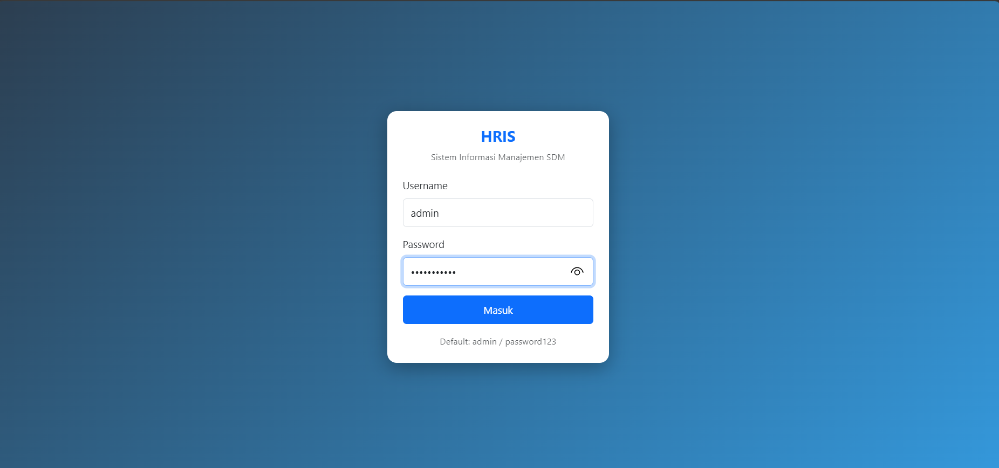

# HRIS App — Sistem Informasi Manajemen SDM

Aplikasi HRIS berbasis web menggunakan CodeIgniter 4.

## Tampilan Program

  
  
  
  
  
  
  

>

## Fitur
- Manajemen User & Karyawan (Admin)
- Absensi Karyawan (mandiri & manual HRD)
- Pengajuan & Persetujuan Cuti
- Laporan Absensi & Cuti (Export Excel & PDF)
- Notifikasi sistem real-time
- Ganti Password

## Teknologi
- PHP 8.x
- CodeIgniter 4
- MySQL
- Bootstrap 5

## Cara Install
1. Clone repo: `git clone https://github.com/USERNAME/hris-ci4.git`
2. Masuk folder: `cd hris-ci4`
3. Install dependency: `composer install`
4. Copy env: `cp env.example .env` lalu sesuaikan konfigurasi DB
5. Buat database: `db_hris`
6. Jalankan migrasi: `php spark migrate`
7. Isi data awal: `php spark db:seed DatabaseSeeder`
8. Jalankan server: `php spark serve`

## Akun Default
| Role | Username | Password |
|------|----------|----------|
| Admin | admin | password123 |
| HRD | hrd01 | password123 |
| Karyawan | karyawan01 | password123 |
